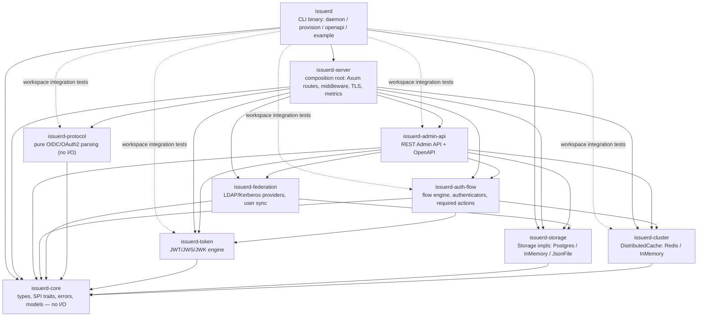

# Architecture Overview

> High-level design and module contracts for **Issuerd**, a Rust-based IAM server.
> Keycloak is used as a reference implementation to ensure protocol parity and functional coverage.
> Operational docs live in `docs/`.

---

## Crate Dependency Graph

Rendered directly by GitLab/GitHub (Mermaid). Source of truth: the
`[dependencies]` sections of the workspace `Cargo.toml` files (dev-dependencies
are omitted — they are test-only and exempt from the direction rule). For the
root package, solid edges are the crates the CLI binary itself links; the
dotted edges are declared in `[dependencies]` so the workspace-level
integration tests under `tests/` can exercise those crates. The `openapi`
export runs through `issuerd_server::openapi::full_openapi()`, which merges the
`issuerd-admin-api` document internally — the binary does not call `issuerd-admin-api`
for it directly.



---

## Layered Architecture

```
┌──────────────────────────────────────────────────────────────────┐
│                   Binary Entry Point (issuerd)                   │
│       CLI (clap) → logging init → config load → bootstrap        │
└──────────────────────────────────────────────────────────────────┘
                                  │
┌──────────────────────────────────────────────────────────────────┐
│                   HTTP Layer (issuerd-server)                    │
│        Axum routes → middleware → TLS → metrics → tracing        │
└──────────────────────────────────────────────────────────────────┘
                                  │
┌──────────────────────────────────────────────────────────────────┐
│                       Protocol & API Layer                       │
│     issuerd-protocol │ issuerd-auth-flow │ issuerd-admin-api     │
└──────────────────────────────────────────────────────────────────┘
                                  │
┌──────────────────────────────────────────────────────────────────┐
│                       Business Logic Layer                       │
│ issuerd-token (JWT engine) │ issuerd-federation (LDAP/Kerberos)  │
└──────────────────────────────────────────────────────────────────┘
                                  │
┌──────────────────────────────────────────────────────────────────┐
│                       Infrastructure Layer                       │
│ issuerd-storage (PostgreSQL) │ issuerd-cluster (Redis/discovery) │
└──────────────────────────────────────────────────────────────────┘
                                  │
┌──────────────────────────────────────────────────────────────────┐
│                 Foundation Layer (issuerd-core)                  │
│      Types │ Traits │ Errors │ Plugin Registry │ Utilities       │
│            Typestate markers (zero-cost state proofs)            │
└──────────────────────────────────────────────────────────────────┘
```

---

## Key Contracts

### Testability Rule
> Every public function must be testable without network I/O or database.

Achieved by:
- All storage via `dyn Storage` trait → `InMemoryStorage` in tests
- All crypto via `dyn CryptoProvider` trait → `MockCryptoProvider` in tests
- All cache via `dyn DistributedCache` trait → `InMemoryCache` in tests
- Protocol parsing is pure functions (no traits needed)

### E2E Testing
> Full stack validation via in-process Axum router.

`tests/harness/mod.rs` provides a `TestHarness` that:
- Builds the complete `app_router()` with `ServerState::from_config(&ServerConfig::default())`
- Uses `InMemoryStorage` and `InMemoryCache` for fast, deterministic, Docker-free tests
- Injects `ConnectInfo<SocketAddr>` into every request so middleware (`proxy_ip_middleware`) works under `Router::oneshot`
- Offers helpers: `create_realm`, `create_client`, `create_user`, `authenticate_user`, `get_admin_token`
- Supports authenticated requests via `get_auth` and `post_json_auth`

### Stateless Rule
> Token validation must not require shared state.

Access tokens are self-contained JWTs. The validation path:
1. Parse JWT
2. Verify signature against JWKS (cached locally)
3. Check `exp`, `nbf`, `iss`, `aud`
4. No DB lookup required

This allows unlimited horizontal scaling of the validation path.

### Dependency Direction Rule
> The crate dependency graph must stay a DAG — no mutual dependencies between crates, ever.

`issuerd-core` is the universal **vocabulary** crate: it owns the SPI traits
(`Storage`, `CryptoProvider`, `DistributedCache`, `FederationProvider`, …), so
every crate may depend on it. Beyond `issuerd-core`, a feature crate may depend on a
lower-layer sibling when it genuinely consumes its concrete implementation.
The sanctioned non-`issuerd-core` edges today:

- `issuerd-auth-flow` → `issuerd-token`, `issuerd-cluster`
- `issuerd-federation` → `issuerd-storage`
- `issuerd-admin-api` → `issuerd-auth-flow`, `issuerd-federation`, `issuerd-token`, `issuerd-storage`, `issuerd-cluster`
- `issuerd-server` → every crate (composition root)
- `issuerd` → `issuerd-server`, `issuerd-core`, `issuerd-storage` directly from the CLI binary, plus `issuerd-protocol`, `issuerd-auth-flow`, `issuerd-token`, `issuerd-cluster`, and `issuerd-admin-api` declared so the workspace integration tests under `tests/` can use them (`issuerd-federation` likewise, as a dev-dependency)

New cross-crate edges must follow the same direction — down-layer only, never
back up into `issuerd-server`/`issuerd-admin-api`, and never introduce a cycle.
Dev-dependencies are exempt (test-only).

### Typestate Safety Rule
> Authentication state transitions must be unrepresentable in incorrect order.

Achieved by:
- `TypedAuthContext<AnonymousState>` → `authenticate(user_id)` → `TypedAuthContext<AuthenticatedState>` (non-optional `UserId`)
- `TypedFlowResult<ActionsPending>` → `into_cleared()` → `TypedFlowResult<ActionsCleared>` → `into_authorized_session()`
- `TypedSession<SessionAuthenticated>` → `require_consent()` → `TypedSession<SessionConsentRequired>` → `authorize(true)` → `TypedSession<SessionAuthorized>` → `issue_token()` → `TypedSession<SessionExpired>`
- All state markers are ZSTs (`PhantomData<fn() -> State>`) — zero runtime overhead
- Layer 1 (`FlowExecutor`) remains unchanged; Layer 2 typed wrappers sit at crate boundaries (`issuerd-auth-flow` → `issuerd-server`)

---

## Horizontal Scaling

```
       ┌───────────────────────────────────────────────────────────────┐
       │                         Load Balancer                         │
       └───────────────────────────────────────────────────────────────┘
               │                       │                       │
     ┌──────────────────┐    ┌──────────────────┐    ┌──────────────────┐
     │  issuerd-server  │    │  issuerd-server  │    │  issuerd-server  │
     │      Node 1      │    │      Node 2      │    │      Node N      │
     └──────────────────┘    └──────────────────┘    └──────────────────┘
               │                       │                       │
               └───────────────────────┼───────────────────────┘
                                       │
               ┌───────────────────────────────────────────────┐
               │        PostgreSQL (Primary + Replicas)        │
               └───────────────────────────────────────────────┘
               ┌───────────────────────────────────────────────┐
               │   Redis Cluster (transient state, counters)   │
               └───────────────────────────────────────────────┘
```

- No sticky sessions required
- Signing keys shared via the `signing_keys` table; JWKS cached in-memory per node (refreshed by storage polling)
- Persistent data (realms, users, clients, sessions) in PostgreSQL
- Transient and coordination state (login-failure counters, pending flows, PAR entries, single-use tokens) in Redis

---

*For clustering operations see `docs/CLUSTERING.md`.*
